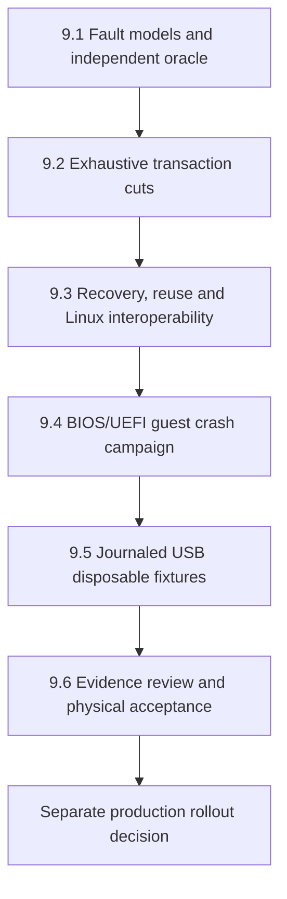

# EXT4 Phase 9 — Crash campaign and E4-B acceptance

Proposed execution plan, 2026-10-04. Phase 8.6 implementation checkpoint:
`3229ad4`. This expands [Phase 9 in the EXT4 plan](EXT4_PLAN.md), without
starting implementation or enabling production journaled RW.

## Boundaries and baseline

Use the existing bounded E4-B feature profile, traditional orphans and exclusive
transaction writer. Preserve ordered-mode limits: overwriting already visible
file data is not promised atomic. Preserve metadata-cache coherence, taint,
durability barriers, DMA quarantine and protected synchronization contracts.
The default image stays ext2; accepted E4-A remains non-journaled. No format
conversion, persistent-root switch, internal-NVMe installation or production
journal mount activation belongs to this campaign.

Phase 8.6 supplies 6,624 focused host crash cuts, 6,712 staging/credit injections,
204 independent Linux host copies and 12 BIOS/UEFI SMP=1/4 guest cases (24 boots).
These are the baseline, not evidence for the proposed exhaustive campaign.
See [the retained results and limits](../roadmap/ext4-phase8-6.md).

## 9.1 — Fault models and independent oracle

Inventory actual write/flush events and operation publication boundaries.
Define a fake device with separate volatile and stable media. Calibrate verified
write-through, working flush with cache loss, reordered unflushed writes,
sector tears, failed/uncertain flush and disconnect models with negative controls.
Specify which outcomes are recoverable and which represent detectable durable
corruption. Never accept arbitrary mount rejection as success for a recoverable
case.

Define independent expected namespace, bytes, inode links, allocated block sets,
reserved ranges and orphan membership at each permissible transaction boundary.
A durable commit must survive loss before checkpoint; an interrupted multi-step
cleanup must resume from its valid durable prefix. State the limits of uncertain
I/O and overwrites explicitly. Freeze finite cut/tear/reordering schedules,
coverage counters, seeds, runtime and storage budgets before running the matrix.

Gate: the model and oracle reject deliberately broken barriers, stale-byte
publication and ownership errors. Every subsequent result identifies its model,
operation boundary and expected outcome.

## 9.2 — Exhaustive mounted transaction cuts

For each declared representative operation, enumerate every write and flush,
before and after, across 1/2/4 KiB blocks, 512/4096-byte sectors and normal/wrapped
journal placement. Extend the mounted operations to fragmented growth, supported
extent-tree transitions, maximum credits, directory growth, rename, truncate,
open-unlink, last close and reallocation. Include shared offsets and independent
append handles. Apply the 9.1 persistence schedules and targeted sector tears
through descriptors, commit records, journal headers and checkpoint metadata.

Restart from stable media with a fresh FortressOS mount, then independently
check bytes, namespace and ownership and run unmounted `e2fsck -fn`. Distinguish
expected corruption rejection from successful recovery. Retain staging/OOM/read
failure and credit-exhaustion checks: no premature publication, unchanged healthy
offsets where required, coherent cache and preserved taint semantics.

Gate: no missing declared cuts, metadata-home bypass, leaked/double allocation,
stale-byte exposure, silent checksum acceptance or unexplained fsck findings.
“Exhaustive” applies to the enumerated finite campaign, not all possible histories.

## 9.3 — Recovery, reuse and interoperability

Cut every replay/checkpoint/orphan-cleanup write and flush; repeat interruption
and recovery to prove progress and idempotence. Exercise multiple traditional
orphans, linked shrink intents, freed-block reuse, revokes, sequence/ring wrap
and journal-full admission. Verify real valid small-journal fixtures where
supported, separately from synthetic credit-budget tests.

Replay FortressOS-written journals on independent Linux copies. Replay supported
Linux-produced journals with FortressOS. Preserve producer provenance and the
documented debugfs zero-UUID normalization boundary from Phase 6; never normalize
hostile corruption into an accepted journal. Audit replayed bytes and namespace,
then require unmounted `e2fsck -fn` exit 0 for recoverable cases. Rejected durable
corruption must not publish RW; preflight rejection cases must perform zero writes.
Failures after admitted recovery I/O must retain their declared taint/error state.

Gate: repeated recovery never overwrites reused blocks with stale replay, loses
required committed metadata or falsely reports clean completion.

## 9.4 — Guest crash campaign

Run BIOS/UEFI, 1/2/4 KiB and SMP=1/4 with disposable GPT/NVMe test images and
explicit fixture admission. Interrupt QEMU at audited transaction/recovery
milestones without orderly sync/freeze, restart FortressOS and apply independent
Linux byte/namespace/fsck audits. Include AP shared/independent append and live
descriptor/orphan lifetimes.

Record the block backend's actual persistence semantics. Killing QEMU does not
simulate loss of the host's volatile disk cache; cache-loss/reordering guarantees
come from the calibrated model or an explicitly controlled backend. Keep those
claims separate. Use bounded waits, exact argv preflight, paired OVMF files and
PID reaping; never attach a real data disk.

Gate: supported guest crash cases recover consistently, and failed recovery never
admits RW or claims clean state before successful drain and barriers.

## 9.5 — Journaled USB disposable fixtures

Create a separately labelled journaled test image and explicit test-only mount
selection. Exercise xHCI/BOT USB under BIOS/UEFI and SMP=1/4: mutation, mid-session
sync followed by more writes, shutdown freeze/drain, reboot, injected failures
and disconnect. Check cache coherence, durability classification and existing
DMA quarantine behavior. Preserve production USB selection and eligibility.

Run relevant E4-A USB, ext2, mount-policy, BOT and shared VFS regressions when
integration changes affect them. `ASSUMED_WRITE_THROUGH` keeps its accepted policy
but cannot support a power-loss durability claim. False flush success must remain
distinct from a verified synchronous flush device.

Gate: journaled disposable USB passes recovery and independent integrity audits;
accepted E4-A and default ext2 remain intact. This gate does not enable production.

## 9.6 — Evidence review and physical acceptance

Review complete coverage and every failure before declaring automated acceptance.
Require exact expected bytes/namespace, ownership agreement, clean fsck for
recoverable cases and precise rejection for unsupported/corrupt inputs. Record
remaining limits and the exact accepted feature/device profile.

Prepare a separate sacrificial-media procedure for Dell testing, with explicit
target identity, internal-NVMe exclusion, device/controller/durability details,
retained images and recovery/audit steps. Physical execution and deliberate power
cuts require separate authorization for that designated media. Clean reboot,
hashes and Mint fsck establish persistence; they alone establish no power-cut
recovery guarantee. Keep physical acceptance pending until actual evidence exists.

Gate: bounded E4-B acceptance records automated and physical results separately.
Any production rollout is a separate reviewed decision. Phase 10 root/package/
installer design remains separate.

## Evidence and execution discipline

Retain campaign artifacts outside `build`, under
`.codex-remote-attachments/ext4-phase9`: source/binary/image hashes, fixture feature
manifests, tool versions, exact commands/argv, seeds, ordered I/O events, tear
locations, persistence schedules, expected/actual outcomes and raw audit logs.
Preserve failed runs. Use immutable base images plus reproducible sector/event
deltas to bound storage; retain complete failing images and verify reconstruction
hashes. Never use automatic fsck repair as evidence that the original was correct.

Implement and verify 9.1 through 9.6 sequentially, with separately reviewable
changes and evidence records. Test target names and budgets are chosen in 9.1;
this document creates no runnable targets and asserts no Phase-9 test passes.
