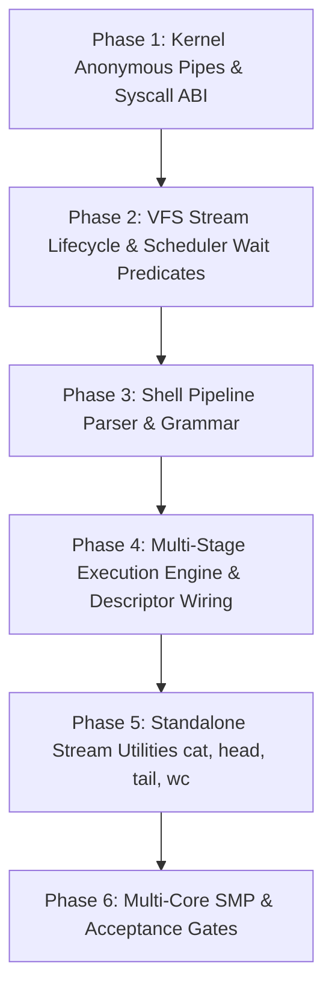

# Shell Milestone S7: Pipes and Stream Utilities — Implementation Plan & Acceptance Audit

**Status:** Phases 1–3 COMPLETE; Phase 4 implemented, user acceptance pending
**Date:** 2026-09-26  
**Author:** AI Agent & Subsystem Architecture Team  
**Scope:** Milestone S7 as specified in [SHELL_DESIGN.md](SHELL_DESIGN.md#s7--pipes-and-stream-utilities) and [AGENTS.md](../../AGENTS.md).  
**Dependencies:** Milestone S6 Complete (uniform file descriptors, spawn actions, atomic append serialization, Dell Latitude 5590 acceptance).

Current evidence: [Phase 1](../roadmap/shell-s7-phase1.md),
[Phase 2](../roadmap/shell-s7-phase2.md), [Phase 3](../roadmap/shell-s7-phase3.md).
The accepted Phase 3 resolution uses the existing flat command array, not a
separate pipeline AST. [Phase 4 implementation](../roadmap/shell-s7-phase4.md)
now awaits user-run tests; [approved design](S7_PHASE4.md).

---

## 1. Executive Summary & Architectural Goals

Milestone S7 elevates FortressOS from single-command execution and file redirection into a composable streaming UNIX-style computing environment. It introduces:
1. **Kernel Anonymous Pipes (`SYS_PIPE`):** Bounded 64 KiB ring-buffer stream nodes with independent reader/writer lifetime tracking, non-busy scheduler blocking, atomic write guarantees, EOF on last writer close, and broken-pipe error signaling (`SYSCALL_EPIPE`).
2. **Strict Scheduler & Lock Safety (L1–L4 & §9):** Zero lock holding across context switches or blocking waits. Wait predicates under `g_sched_lock` evaluate lock-free atomic states, completely eliminating rank inversion and sleep-check races.
3. **POSIX-Aligned Spawn Action & CLOEXEC Lifecycle:** Streamlining `SYS_SPAWN_EXT` descriptor cloning so child processes retain CLOEXEC descriptors during `SPAWN_FD_ACTION_*` execution and automatically strip all remaining CLOEXEC descriptors in a post-action pass. This ensures child stages inherit only their dup'd standard streams without leaking intermediate pipe ends.
4. **Shell Multi-Stage Pipeline Execution & Self-Terminating Teardown:** Lexer/parser pipeline grammar (`cmd1 | cmd2 | ... | cmdN`), coordinated descriptor plumbing, prompt closing of unused ends in parent and children, collective child reaping, simulated POSIX exit status 141 on broken pipes, and graceful self-termination on partial spawn failures.
5. **Byte-Preserving Stream Tools:** Rebuilding `cat` as a transparent, unescaped byte-stream tool with stdin/`-` and multi-file support, accompanied by symmetric filter utilities (`head -n/-c`, `tail -n/-c`, `wc -l/-w/-c`). Optional utilities (`tee`, `printf`, `grep`) are deferred to S7.5.
6. **Resolution of S6 Finding 8:** Formalization of concurrent shared-`file_t` non-append I/O rules across multi-process pipelines.

---

## 2. Architecture & Design Decisions (Review Resolutions)

### 2.1 Pipe Buffer Sizing, Atomicity & Wraparound Rules
- **Capacity Choice:** `PIPE_CAPACITY` is set to **64 KiB** (`16 * PAGE_SIZE`), matching the modern standard (Linux default) to prevent context-switch thrashing on multi-megabyte streams.
- **Allocation Source:** Allocated from the Physical Memory Manager (PMM) via `pmm_alloc_pages(16)` and accessed through the kernel HHDM via `vmm_phys_to_virt()`. On pipe destruction, physical frames are reclaimed via `pmm_free_pages(phys, 16)`.
- **Atomic Threshold & Space Requirement Rule:**
  - `PIPE_BUF` is defined as **4096 bytes** (POSIX standard).
  - For writes of `len <= PIPE_BUF`:
    - The writer blocks until **`len` bytes** of free space are available (not `PIPE_BUF` bytes, preventing capacity-induced deadlocks when exchanging smaller messages).
    - Once `len` bytes are free, the writer commits all `len` bytes under `pipe->lock`.
    - Logical ring wraparound (e.g. crossing from byte 63000 back to 0) is explicitly permitted. Atomicity is strictly preserved because the entire write transaction is serialized under `pipe->lock`, preventing any interleaved writes from concurrent processes.
  - For writes of `len > PIPE_BUF`: writes may complete partially or interleave when the buffer fills and the writer blocks.

---

### 2.2 Counter Definitions & Endpoint Lifetime
- **Separation of Counters:**
  - `readers`: Active `file_t` descriptions open for reading (starts at 1 in `pipe_create`, decremented in `pipe_close_endpoint`).
  - `writers`: Active `file_t` descriptions open for writing (starts at 1 in `pipe_create`, decremented in `pipe_close_endpoint`).
  - `active_endpoints`: Refcount of the `pipe_t` struct itself (starts at 2: 1 for `read_node`, 1 for `write_node`).
- **File Refcount Interaction:**
  - In FortressOS, `dup`, `dup2`, and `SYS_SPAWN_EXT` descriptor cloning all share the underlying `file_t` description via atomic acquire-release refcounting (`__atomic_fetch_add(&file->ref_count, 1, __ATOMIC_ACQ_REL)`).
  - `vfs_close()` drops a file reference on each call; `node->close()` runs only on final release.
  - Therefore, `readers` and `writers` are decremented inside `node->close(node)` at the exact moment the file description is closed. This guarantees that `readers` and `writers` accurately reflect open descriptions and eliminates any race with `dup()`.
- **Teardown Flow:**
  - When `readers` drops to 0: wakes all blocked threads on the pipe channel via `sched_wake_all(pipe)` (writers fail with `SYSCALL_EPIPE`). `read_node->fs_private` is cleared, and `active_endpoints` is decremented.
  - When `writers` drops to 0: wakes all blocked threads on the pipe channel via `sched_wake_all(pipe)` (readers return EOF). `write_node->fs_private` is cleared, and `active_endpoints` is decremented.
  - Close wakes waiters after unlocking and before dropping `active_endpoints`. The last release frees both anonymous VFS nodes (never linked into the namespace), returns 16 physical pages and frees `pipe_t`.

---

### 2.3 Atomic Mirror Update Ordering & Wait Channel Discipline
- **Mirror Update Sequence (Under Lock):**
  1. Update ring buffer pointers (`head`, `tail`, `count`) while holding `pipe->lock`.
  2. Update atomic mirror fields under lock before releasing:
     ```c
     __atomic_store_n(&pipe->data_bytes, pipe->count, __ATOMIC_RELEASE);
     __atomic_store_n(&pipe->space_bytes, PIPE_CAPACITY - pipe->count, __ATOMIC_RELEASE);
     ```
  3. Release `pipe->lock` via `spin_unlock_irqrestore(&pipe->lock, rflags)`.
  4. Perform `sched_wake_all(pipe)` **after** `pipe->lock` has been completely released.
- **Unified Wait Channel:**
  - Readers and writers wait on a single channel cookie: the `pipe_t *` itself.
  - Calling `sched_wake_all(pipe)` wakes all waiters; each thread evaluates its respective predicate (`pipe_read_ready` or `pipe_write_ready`) under `g_sched_lock`. Ready threads resume; unready threads return to sleep. This avoids channel mismatch bugs and follows the established `input_read` pattern.

---

### 2.4 `SYS_SPAWN_EXT` Action Ordering & Auto-CLOEXEC Resolution
- **The Problem:** In S6, `fd_clone_table` stripped CLOEXEC descriptors *before* spawn actions ran. If parent pipe descriptors were created with `VFS_O_CLOEXEC`, `SPAWN_FD_ACTION_DUP2(pipe_fd, 0)` would fail with `SYSCALL_EBADF` because the child did not inherit `pipe_fd`. If pipes were created without `CLOEXEC`, every child stage would leak all other stages' pipe descriptors, causing readers to hang indefinitely waiting for EOF.
- **The POSIX-Aligned Architectural Solution:**
  1. **Phase A (Initial Clone):** `fd_clone_table` clones all parent descriptors into the child **retaining their `FD_FLAG_CLOEXEC` flags**.
  2. **Phase B (Action Processing):** `SPAWN_FD_ACTION_*` actions execute in the child. `SPAWN_FD_ACTION_DUP2(src_fd, dst_fd)` duplicates `src_fd` (which may be CLOEXEC) to `dst_fd`, and clears `FD_FLAG_CLOEXEC` on `dst_fd`.
  3. **Phase C (Post-Action CLOEXEC Sweep):** Immediately following action processing in the child, the kernel iterates over `p->fd_flags`:
     ```c
     for (int i = 0; i < MAX_PROCESS_FDS; i++) {
         if (p->fd_table[i] && (p->fd_flags[i] & FD_FLAG_CLOEXEC)) {
             vfs_close(p->fd_table[i]);
             p->fd_table[i] = NULL;
             p->fd_flags[i] = 0;
         }
     }
     ```
- **Guaranteed Invariant:**
  - The parent shell creates all intermediate pipes with `VFS_O_CLOEXEC`.
  - In each child stage, `SPAWN_FD_ACTION_DUP2` dups only the stage's designated input and output pipes to stdin (0) and stdout (1).
  - The post-action sweep automatically closes all other pipe descriptors in the child!
  - No pipe write ends leak into downstream children, EOF propagates promptly, and zero manual `CLOSE` actions are needed.

---

### 2.5 Pipeline Failure Recovery & Natural Self-Termination
Closing endpoints releases cooperative pipe readers/writers; it does not cancel
arbitrary children that ignore I/O or have redirected away from the pipe. No
SYS_KILL exists. The sequence below does not guarantee bounded recovery for every
program; Phase 4's handoff records this limitation and uses bounded test fixtures.
- If stage 0 fails to spawn (e.g. `ENOENT` / `EMFILE`): parent closes all pipes and returns immediately.
- If stage `k > 0` fails to spawn:
  1. Parent immediately closes all intermediate pipe descriptors in its own table.
  2. Already-spawned children (`0..k-1`) self-terminate naturally without requiring `SYS_KILL`:
     - Downstream stages waiting to read encounter EOF once upstream stages complete.
     - Upstream stages attempting to write encounter `SYSCALL_EPIPE` because the reader end is closed, triggering exit 141.
  3. Parent calls `SYS_WAIT` on each already-spawned PID, reaping all resources cleanly before returning error status to the shell prompt.

---

### 2.6 Pipeline Stage Limit (`MAX_PIPE_STAGES = 8`) & Memory Layout
- **Source of Limit:** Specified in [SHELL_DESIGN.md](SHELL_DESIGN.md#s7--pipes-and-stream-utilities) §3.2 (Resource Limits Table: "Pipeline: 8 stages initially").
- **Descriptor Budget:**
  - 8 stages require 7 pipes = 14 parent fds.
  - 14 fds + 3 standard streams + 1 retained UI terminal = 18 fds, fitting comfortably within the 32-descriptor table limit (`MAX_PROCESS_FDS = 32`).
- **Stack Budget Invariant:**
  - Ring 3 user stack is strictly **4 KiB** (1 page frame) with a mandatory **512-byte stack frame headroom** constraint.
  - Phase 3 keeps the existing static `parse_tree_t` with flat `parse_cmd_t[]` and `CMD_OP_PIPE`. No `parse_pipeline_t` is needed. Phase 4 groups consecutive pipe markers and keeps preparation/action/PID buffers in BSS, following `s_parent_scope` and `s_expanded_cmd`.

---

### 2.7 VFS Close Lifecycle Hook & Clean Signature
- Extend [vfs_node_t](../../src/fs/vfs.h) with clean, non-redundant close hook:
  ```c
  void (*close)(struct vfs_node *node);
  ```
- **Default Handling:** All existing nodes (ext2, tarfs, terminal, null) explicitly set `close = NULL`.
- In [src/fs/vfs.c](../../src/fs/vfs.c), `vfs_close()` safely handles NULL:
  ```c
  if (__atomic_sub_fetch(&file->ref_count, 1, __ATOMIC_ACQ_REL) <= 0) {
      if (file->node && file->node->close) {
          file->node->close(file->node);
      }
      kfree(file);
  }
  ```
- **Lock Rank Discipline (L1–L4):** Verified in `src/fs/vfs.c` and `src/kernel/thread.c` that `vfs_close()` runs with **zero** locks held. Calling `sched_wake_all(pipe)` inside `pipe_close_endpoint` is completely safe and non-blocking.

---

### 2.8 -EPIPE Semantics & Simulated POSIX Exit Status (141)
- **Contract Boundary:** FortressOS does not implement POSIX signals (signals, job control, and `SIGPIPE` belong to Milestone S8).
- **Defined S7 Behavior:**
  - Writing to a pipe with no open reader returns `SYSCALL_EPIPE` (-20) directly to the writer process.
  - Phase 5 filter tools check stdout writes and exit **141** on `SYSCALL_EPIPE` (`128 + 13`, simulating POSIX `SIGPIPE` termination).
  - The shell collects the exit status via `SYS_WAIT` and reflects 141 in `$?`.

---

### 2.9 Stream Utility Scope & Bounded Memory Contracts
- **`cat` ([user/tools/cat.c](../../user/tools/cat.c)):**
  - Transparent byte-preserving I/O (no `.` substitution, no forced trailing newline).
  - Reads from stdin if no arguments or `-` is specified.
  - Supports multiple input files sequentially: `cat file1 - file2`.
- **`head` ([user/tools/head.c](../../user/tools/head.c)):**
  - Line mode (`-n [lines]`, default 10) and byte mode (`-c [bytes]`).
- **`tail` ([user/tools/tail.c](../../user/tools/tail.c)):**
  - Line mode (`-n [lines]`, default 10) and byte mode (`-c [bytes]`).
  - **Bounded Buffer Contract:** On non-seekable streams (pipes), line mode uses a bounded circular line buffer of `N` lines, capped at `MAX_TAIL_LINE_LEN = 4096` bytes per line (40 KiB static BSS buffer). Lines exceeding 4096 bytes are truncated within the tail buffer. Byte mode uses a 64 KiB ring buffer.
- **`wc` ([user/tools/wc.c](../../user/tools/wc.c)):**
  - Counts lines (`-l`), words (`-w`), and bytes (`-c`).
- **Deferred to Milestone S7.5:**
  - `tee`, `printf`, and `grep`.

---

### 2.10 Kernel Self-Test Execution Window in `kmain`
- In [src/kernel/main.c](../../src/kernel/main.c), `test_pipe_kernel_lifecycle()` runs alongside the other optional acceptance tests, gated by `opt/fortress/pipe_test`.
- At this point in the boot sequence:
  - SMP, PMM, VMM, and the scheduler are fully initialized and online.
  - The test runs *before* `input_init()` and the `/bin/shell` spawn loop.
  - The self-test operates exclusively on in-memory anonymous pipes, with zero dependency on `/mnt` or external storage.

---

## 3. Data Structures & Subsystem Design

### 3.1 Kernel Pipe Structures (`src/fs/pipe.h`)

```c
#ifndef FORTRESS_PIPE_H
#define FORTRESS_PIPE_H

#include "types.h"
#include "spinlock.h"
#include "vfs.h"

#define PIPE_CAPACITY   (64 * 1024)   /* 64 KiB ring buffer (16 PMM physical frames) */
#define PIPE_BUF         4096          /* POSIX atomic write guarantee */

typedef struct pipe {
    spinlock_t   lock;              /* Ranked spinlock protecting ring buffer indices */
    uintptr_t    buffer_phys;       /* Physical base of 16-page allocation */
    uint8_t     *buffer;            /* Virtual HHDM mapping of buffer */
    size_t       head;              /* Write index (0..PIPE_CAPACITY-1) */
    size_t       tail;              /* Read index (0..PIPE_CAPACITY-1) */
    size_t       count;             /* Current buffered byte count */

    /* Atomic state flags for lock-free scheduler predicate evaluation */
    _Atomic uint32_t readers;       /* Active reader file_t count */
    _Atomic uint32_t writers;       /* Active writer file_t count */
    _Atomic uint32_t data_bytes;    /* Mirrored atomic byte count for readers */
    _Atomic uint32_t space_bytes;   /* Mirrored atomic free space for writers */
    _Atomic uint32_t active_endpoints; /* Refcount: 2 (read & write), last drops frees pipe */

    /* VFS stream nodes */
    vfs_node_t  *read_node;
    vfs_node_t  *write_node;
} pipe_t;

int  pipe_create(vfs_node_t **out_read_node, vfs_node_t **out_write_node);
void pipe_close_endpoint(vfs_node_t *node);

#endif /* FORTRESS_PIPE_H */
```

### 3.2 Lock-Free Scheduler Predicates (L1–L4 & §9)

```c
static bool pipe_read_ready(void *arg) {
    pipe_t *p = (pipe_t *)arg;
    return __atomic_load_n(&p->data_bytes, __ATOMIC_ACQUIRE) > 0 ||
           __atomic_load_n(&p->writers, __ATOMIC_ACQUIRE) == 0;
}

typedef struct {
    pipe_t *pipe;
    size_t needed_space;
} pipe_wait_write_t;

static bool pipe_write_ready(void *arg) {
    pipe_wait_write_t *w = arg;
    return __atomic_load_n(&w->pipe->space_bytes, __ATOMIC_ACQUIRE) >= w->needed_space ||
           __atomic_load_n(&w->pipe->readers, __ATOMIC_ACQUIRE) == 0;
}
```

Wait operations release `pipe->lock` before `sched_wait_until`. Readers pass the
pipe; writers pass a live `pipe_wait_write_t` whose threshold is count for writes
up to PIPE_BUF, otherwise 1. Both recheck under the pipe lock on return.
Current wait queues/wakeups are CPU-local: all peers must stay on the same CPU.
Cross-core channel support remains Phase 6 work.

---

## 4. Staged Implementation Phases



### Phase 1: Kernel Anonymous Pipes & Syscall ABI — COMPLETE
- Define `SYS_PIPE` (24) and `SYSCALL_EPIPE` (-20) in [src/include/syscall_abi.h](../../src/include/syscall_abi.h).
- Implement `src/fs/pipe.h` and `src/fs/pipe.c` ring-buffer primitives with 64 KiB PMM backing.
- Wire `sys_pipe` dispatcher in [src/kernel/syscall.c](../../src/kernel/syscall.c) with canonical user address validation and descriptor allocation rollback.
- **Verification:** Host unit tests in `tests/pipe_host.c` verifying 64 KiB ring buffer wraparound, partial reads/writes, and `PIPE_BUF` atomic boundary assertions.

### Phase 2: VFS Stream Lifecycle & Scheduler Blocking — COMPLETE
- Extend [vfs_node_t](../../src/fs/vfs.h) with `void (*close)(vfs_node_t *node)`.
- Update `vfs_close()` in [src/fs/vfs.c](../../src/fs/vfs.c) to invoke `node->close` when file reference count drops to 0.
- Update `process_spawn_internal` in [src/kernel/thread.c](../../src/kernel/thread.c) to implement the 3-phase CLOEXEC lifecycle (clone with flags -> execute actions -> sweep remaining CLOEXEC fds).
- Implement lock-free wait predicates `pipe_read_ready` and `pipe_write_ready`.
- Verify EOF signaling on writer close and `EPIPE` signaling on reader close.
- **Verification:** Kernel self-tests in [src/kernel/main.c](../../src/kernel/main.c) testing pipe creation, EOF detection, and reader/writer wakeup.

### Phase 3: Shell Pipeline Parser & Grammar — COMPLETE
- Add `TOK_PIPE` to [user/shell/lexer.h](../../user/shell/lexer.h) and `lexer.c`.
- Record `CMD_OP_PIPE` in the existing flat command array; reject runs longer than eight stages. Phase 4 groups stages and resolves execution precedence.
- At the Phase 3 checkpoint, `parser_execution_guard` rejected any tree containing a pipe before execution. Phase 4 has now removed it in favor of group execution and unsupported-stage preflight.
- Add parser tests in `tests/shell_host.c` exercising `cmd1 | cmd2`, `cmd1 | cmd2 | cmd3`, `cmd1 | cmd2 && cmd3`, and syntax error recovery.

### Phase 4: Multi-Stage Execution Engine & Descriptor Plumbing
- Implemented; see [review decisions](S7_PHASE4.md) and [implementation handoff](../roadmap/shell-s7-phase4.md). Runtime acceptance is pending; no new test passes claimed.
- Implement pipeline execution loop in [user/shell.c](../../user/shell.c) using static BSS arenas (preserving the 512B stack budget).
- Wire `SYS_PIPE` and `SPAWN_FD_ACTION_DUP2` across stages with `VFS_O_CLOEXEC`.
- Verify prompt parent pipe closure, preventing reader hangs.
- Keep Phase 4 BSP-only and external-program-only; reject builtin stages before side effects.
- On partial launch failure, close parent pipe descriptors, blockingly wait for every launched child, and return the original launch error. Cleanup relies on cooperative child completion; arbitrary cancellation is deferred.
- **Verification:** Live integration runner `scripts/test_shell_s7.py` running basic pipelines under QEMU.

### Phase 5: Standalone Stream Utilities
- Add builtin pipeline-stage support; Phase 4 rejects these stages explicitly.
- Create `user/tools/` directory and implement `cat.c` (byte-preserving), `head.c` (-n/-c), `tail.c` (-n/-c), `wc.c` (-l/-w/-c).
- Update [Makefile](../../Makefile) to compile each tool into freestanding ELF binaries and package them into `bin/initramfs.tar`.
- **Verification:** Chained pipeline tests: `cat /large_file | head -n 50 | wc -l`.

### Phase 6: Multi-Core SMP & Formal Acceptance
- Run multi-stage pipelines under QEMU `-smp 4` and `-smp 8` (BIOS and UEFI).
- Verify throughput with payloads > 256 KiB (exceeding pipe capacity by 4x).
- Validate lock discipline and contention metrics.
- Physical Dell Latitude 5590 hardware acceptance.

---

## 5. Acceptance Audit Checklist & Verification Matrix

| Checkpoint | Gate / Target | Success Criteria |
| :--- | :--- | :--- |
| **G1: Host Pipe Unit Suite** | `tests/pipe_host.c` (ASan/UBSan) | Full 64 KiB ring-buffer wraparound, partial reads/writes, `PIPE_BUF` atomic boundaries, 0 leaks, 0 undefined behavior. |
| **G2: Host Shell Grammar** | `tests/shell_host.c` (ASan/UBSan) | Flat operator sequence, eight-stage limit, empty stage rejection, quote isolation and interim execution guard. Execution precedence belongs to Phase 4. |
| **G3: Streaming Throughput** | QEMU BIOS & UEFI (`make test-shell-s7`) | 256 KiB payload streamed through 3-stage pipeline (`cat \| cat \| cat`), bit-for-bit SHA-256 match. |
| **G4: EOF & Broken Pipe** | QEMU BIOS & UEFI | Reader terminates immediately with EOF when writer closes; writer receives `EPIPE` when reader exits early and reports exit 141. |
| **G5: Resource Bounds & Recovery** | QEMU BIOS & UEFI | Pipe descriptor exhaustion (`EMFILE`), process limit exhaustion, failed stage rollback, natural child self-termination, prompt recovery. |
| **G6: Multi-Core SMP Safety** | QEMU `-smp 4` & `-smp 8` | Producer on CPU 1, consumer on CPU 2; 0 deadlocks, clean work-stealing, lock hierarchy assertions pass. |
| **G7: Physical Hardware Acceptance** | Dell Latitude 5590 (Bare-Metal) | Pipeline execution, stream utilities, clean serial/framebuffer output, clean shutdown. |
